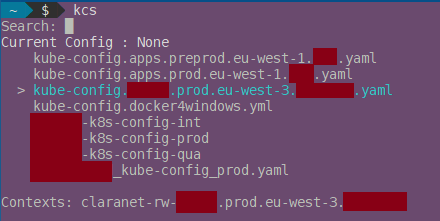
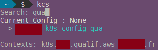

# KCS

## Description

Select which *kubeconfig.yaml* to use in an easy way. **KCS** means **kubeconfig switcher**.

Features :
- Select item with &larr;, &uarr;, &rarr; &darr;
- Filter by a search
- Display contexts of selected kube config file




## Configuration

### Create config file
```
echo "KUBECONFIG_FILES=XXX" > $HOME/.kcs
```
with `XXX` the full path to your directory with *kubeconfig.yaml* files

### Add binary
```
sudo cp kcs /usr/local/bin/
```

## Usage
```
kcs
```
```
$ kcs
Search: █
? :
    kube-config.apps.prod.eu-west-1.XXX.yaml
  > kube-config.XXXXX.prod.eu-west-3.XXXXX.yaml
    kube-config.docker4windows.yml
    XXXXX_kube-config_prod.yaml

Contexts: claranet-rw-XXXX.prod.eu-west-3.XXXXX
```

## Author

Thomas Labarussias (thomas.labarussias@fr.clara.net - https://github.com/Issif)


